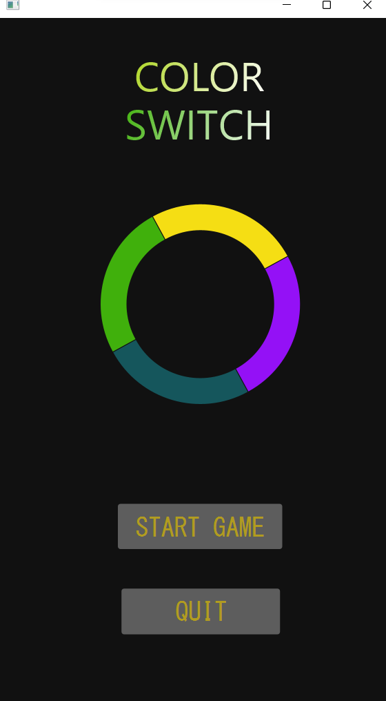
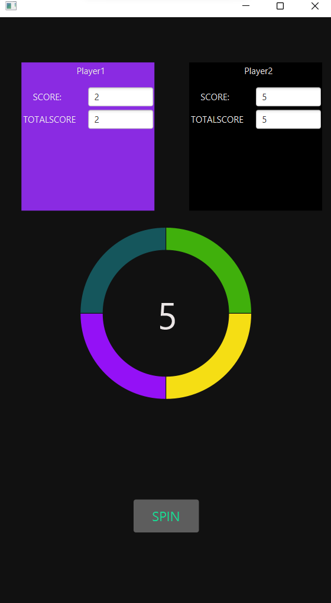
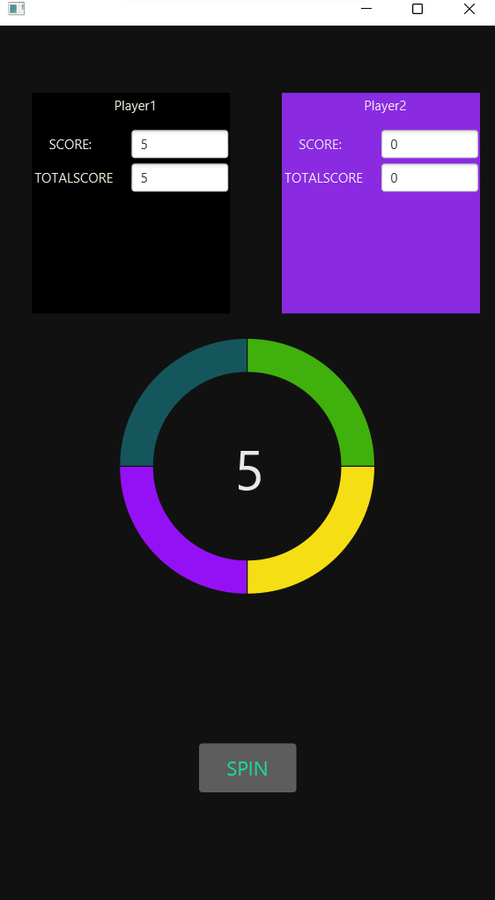

# ColorSwitch
Created by: Deva Karthik and Sanjeev

Color Switch is a spin based game . The objective of the app is to play through 2 different players player-1 and player-2, by pressing the button spin which generates a random number and the generated number is added for the player who clicked on it.
The Player who reaches the high score first wins the game.

Made to develop the idea of using oops concepts of java in the field of game development. 

Frontend is developed using JavaFX and the working and backend part uses Java language.
 
Dependencies : 
The game is implemented using Java and JavaFX.

